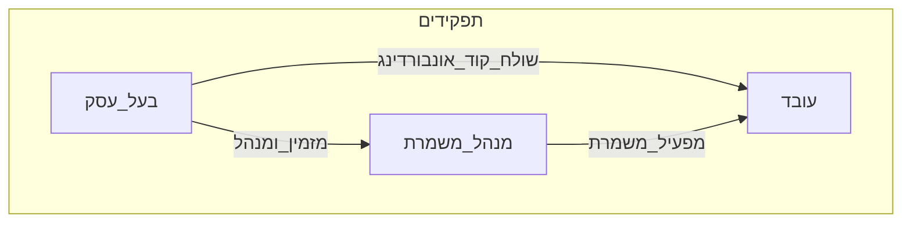
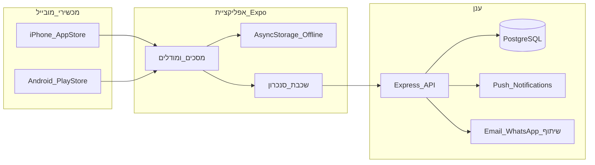
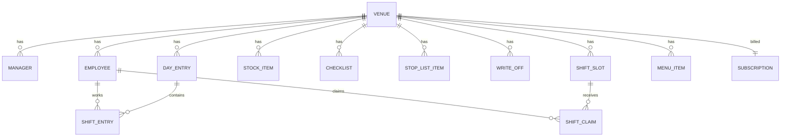
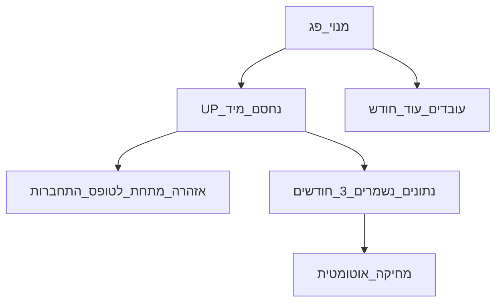
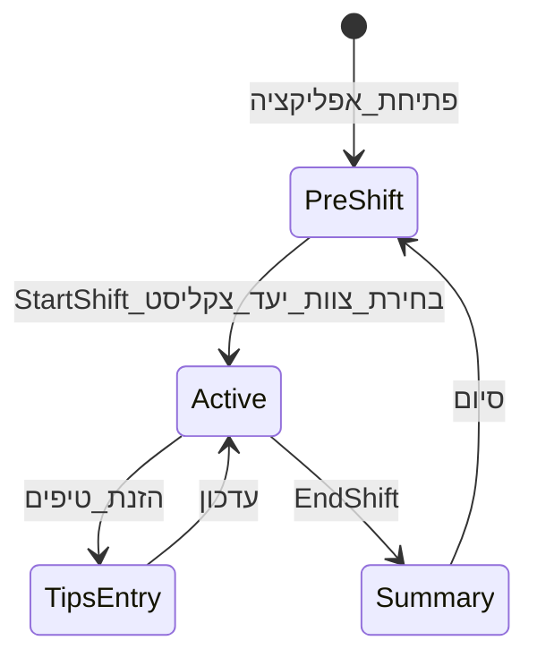
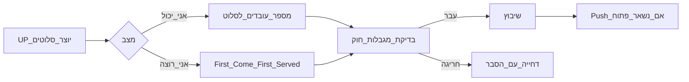
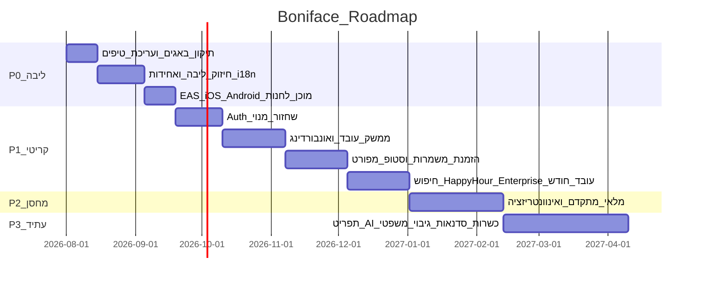

# Boniface — אפיון מוצר מלא

**גרסה:** 1.0 · אוגוסט 2026  
**סטטוס:** אפיון לבנייה מאפס  
**מסמך נלווה:** [`rules.md`](rules.md) · [`improvments.md`](improvments.md)

---

## 0. מה זה המסמך / מה זה לא

| כן | לא |
|----|-----|
| אפיון של **אפליקציית מובייל נייטיב** (iOS + Android) | מוצר ווב / אתר לקוחות |
| מפרט ליבה + כל ה-roadmap | הצדקה שיווקית ארוכה |
| דיאגרמות, מודל נתונים, קריטריוני קבלה | מדריך שימוש למשתמש קצה |

**ערוץ הפצה היחיד למוצר:** Apple App Store + Google Play.  
**GitHub / Markdown בדפדפן:** רק לצפייה באפיון ובקוד בזמן פיתוח — **לא** חלק מהמוצר ולא חוויית משתמש.

---

## 1. חזון ומיצוב

### 1.1 משפט מוצר
**Boniface** — אפליקציית ניהול בר לניידים, למנהלי משמרת ובעלי עסק בברים ומסעדות בישראל.

### 1.2 תגליין
> ניהול בר באצבע אחת — משמרות, מלאי, טיפים וצוות, בזמן אמת וגם אופליין.

### 1.3 עקרונות מוצר (מחייבים)

1. **Mobile-only** — חוויית משתמש מלאה באפליקציה בלבד. אין דשבורד ווב ללקוח.
2. **Offline-first** — פעולות ליבה עובדות בלי רשת; סנכרון כשיש חיבור.
3. **One-finger** — מסכים קצרים, פעולות מהירות, haptic feedback, מינימום הקלדה.
4. **ללא POS ב-v1** — אין אינטגרציית קופה בשלב הראשון.
5. **שוק ישראלי** — שקל כברירת מחדל, חוק עבודה ישראלי (משמרות), PDPA, RTL לעברית.
6. **שפות:** עברית · רוסית · אנגלית (עם RTL מלא ל-he).

### 1.4 מה במוצר / מה בחוץ (v1 ובכלל)

| בפנים | בחוץ (לפחות ב-v1) |
|--------|-------------------|
| משמרות, טיפים, צוות, מלאי בר, סטופ-ליסט, צ'ק-ליסטים | קופה / POS |
| ממשק מנהל + ממשק עובד | אתר ניהול בדפדפן |
| מנוי + Feature Cards | מסחר כרטיסים בין משתמשים (עתיד רחוק) |
| Push, WhatsApp/Email לשיתוף דוחות | סושיאל נטוורק פנימי |

---

## 2. קהל יעד ופרסונות

### 2.1 בעל עסק (UP — Owner)
- בעלים / מנהל כללי של בר אחד או יותר.
- נרשם עם טלפון + PIN (ושחזור בהמשך).
- רואה הכל: כספים, צוות, מלאי, מנוי, ריבוי מקומות (Enterprise).
- נחסם מיד כשהמנוי פג; נתונים נשמרים 3 חודשים ואז נמחקים.

### 2.2 מנהל משמרת
- מפעיל את האפליקציה במשמרת: פתיחה/סגירה, טיפים, סטופ-ליסט, מלאי, צ'ק-ליסטים.
- זה המשתמש המרכזי של הליבה היום.

### 2.3 עובד (ברמן / מלצר / וכו')
- ממשק מצומצם משלו (לא תצוגת מנהל).
- אונבורדינג בקוד אישי מ-WhatsApp/אימייל.
- לוקח משמרות, מדווח אזילה, רואה את הדאשבורד שלו.
- אחרי פקיעת מנוי: גישה עוד חודש.



---

## 3. פלטפורמה והפצה

### 3.1 פלטפורמות יעד
| פלטפורמה | כלי | חנות |
|----------|-----|------|
| iOS | Expo + EAS Build | Apple App Store |
| Android | Expo + EAS Build | Google Play |

Bundle ID: `com.boniface.barmanager`  
אוריינטציה: Portrait  
מצב UI: Dark תמיד

### 3.2 מה לא בונים כמוצר
- אין Progressive Web App ללקוח.
- אין פאנל אדמין ווב לבעל העסק (ניהול רק באפליקציה).
- `server/serve.js` / static web — לכל היותר landing טכני לחנויות, לא האפליקציה עצמה.

### 3.3 Backend (לא UI)
שרת API + DB בענן לאימות, סנכרון, Push, מנויים.  
המשתמש **לא** פותח את השרת בדפדפן כחלק מהמוצר.

---

## 4. סטאק טכני (מחייב)

| שכבה | טכנולוגיה |
|------|-----------|
| Mobile | Expo SDK 54, React Native, expo-router |
| UI | Reanimated, Blur, LinearGradient, Haptics, Inter |
| State / Data | TanStack Query, AsyncStorage, Zod |
| API client | Orval → React Query hooks (מתוך OpenAPI) |
| Backend | Node.js, Express 5, TypeScript |
| DB | PostgreSQL + Drizzle ORM |
| מונוריפו | pnpm workspaces |
| Build חנויות | EAS (APK/AAB + iOS) |
| עיצוב | רקע `#111827`, אקסנט זהב `#F59E0B`, dark-only |

---

## 5. ארכיטקטורה



### 5.1 כללי Offline / Sync

| דומיין | Offline | Sync לענן |
|--------|---------|-----------|
| טיפים + יומן ימים | כן | כן (כשמחוברים) |
| עובדים | כן | כן |
| משמרת פעילה | כן | כן (לאחר P1) |
| מלאי / סטופ-ליסט / מחיקות | כן | כן (לאחר P1–P2) |
| צ'ק-ליסטים | כן | כן |
| מנוי / Feature Cards | cache מקומי | מקור אמת בשרת |

**קונפליקטים:** Last-write-wins עם חותמת זמן שרת; פעולות קריטיות (סגירת משמרת, טיפים) לא נמחקות בשקט — מוצגת התראה אם נכשל הסנכרון.

---

## 6. מודל נתונים



### 6.1 ישויות ליבה

**Venue** — `id`, `name`, `currency` (ILS/USD/EUR), `timezone`, `createdAt`  
**Manager (UP)** — `id`, `venueId`, `name`, `phone`, `pinHash`, `securityQuestion?`, `createdAt`  
**Employee** — `id`, `venueId`, `name`, `roles[]`, `phone?`, `inviteCode?`, `authPin?`, `onboardedAt?`  
**DayEntry** — `id`, `venueId`, `date`, `totalCash`, `totalCard`, `shifts[]`  
**ShiftEntry** — `id`, `employeeId`, `employeeName`, `tipMode` (`hours`|`percent`), `startTime`, `endTime`, `cashPercent`, `cardPercent`  
**ShiftState (פעיל)** — `active`, `startTime`, `startDate`, `employeeIds[]`, `tipsGoal?`  
**StockItem** — `id`, `name`, `category`, `quantity`, `unit`, `minQuantity`, `purchasePrice?`, `portionsPerUnit?`, `sellingPrice?`, `expiryDate?`, `subCategory?`, `bottleShape?`  
**StopListItem** — `id`, `name`, `reason?`, `addedAt`, `shiftScoped`  
**WriteOff** — `id`, `date`, `itemId?`, `itemName`, `quantity`, `unit`, `reason`, `notes?`  
**Checklist / ChecklistItem** — `type` (`opening`|`closing`|`preshift`|`custom`), items עם `done`  
**Subscription** — `status`, `expiresAt`, `plan`, grace לעובדים  
**ShiftSlot / ShiftClaim** — הזמנת משמרות (P1)  
**MenuItem / Recipe / Batch** — תפריט וטכנולוגיה (P3)

### 6.2 קטגוריות מלאי (ליבה)
`spirits` | `wine` | `beer` | `mixers` | `garnish` | `supplies`  
הרחבה (P2): תת-קטגוריות `Display` / `Speed Bar` / `מחסן` + מותאמות.

### 6.3 תפקידי צוות (תוויות, לא הרשאות מערכת)
ברמן · מלצר · הוסטס · ברבק · מנהל משמרת · טבח · אבטחה

---

## 7. אימות, הרשאות ומנוי

### 7.1 Auth — בעל עסק / מנהל
1. הרשמה: שם מקום + שם מנהל + טלפון + PIN (≥4).
2. התחברות: טלפון + PIN.
3. שחזור (P1): אימייל + שאלת אבטחה.
4. Session: Bearer token; `GET /auth/me` בבוטסטראפ.

### 7.2 Auth — עובד (P1)
1. UP שולח קישור WhatsApp/Email עם קוד אישי.
2. העובד מוריד מהחנות → מזין קוד → מגדיר פרופיל/PIN → דאשבורד עובד.
3. שחזור גישה רק דרך UP (איפוס קוד/PIN).

### 7.3 התנהגות מנוי שפג



### 7.4 תמחור (בסיס)
- מנוי בסיסי: **₪26 / חודש** (ניתן לעדכון ב-Feature Cards / סוף).
- Feature Cards בסגנון RPG (Common → Legendary) לפתיחת יכולות פרימיום.
- רכישה: In-App Purchase (App Store / Play) — מקור אמת בחנויות + אימות בשרת.
- אין דשבורד תשלומים בדפדפן למשתמש.

---

## 8. מפת מסכים (אפליקציה)

### 8.1 ניווט מנהל (קיים + יעד)

```
Root Stack
├── (tabs)
│   ├── Home          דאשבורד משמרת 3-שלבי
│   ├── Team          צוות
│   ├── Quick         פעולות מהירות (מרכז)
│   ├── Bar           מלאי / בר
│   └── More          הגדרות, שפה, כרטיסים, חשבון
├── Cards             Feature Cards
├── Account           הרשמה / התחברות / מקום
├── Briefing          תדריך לפני משמרת
├── Schedule          לוח שבועי + הזמנת משמרות
├── History           היסטוריית ימים
├── Stats             אנליטיקה
└── Search            חיפוש גלובלי (P1)
```

### 8.2 ממשק עובד (P1) — מצב נפרד
- בית: המשמרת שלי / הזמנת משמרות
- דיווח אזילה → סטופ-ליסט
- צ'ק-ליסטים שהוקצו
- פרופיל + טיפים שלי (קריאה)
- **אין** גישה להגדרות מקום, מחיקת צוות, מנוי, מלאי מלא

### 8.3 Home — 3 פאזות
1. **לפני משמרת:** שעה + התקדמות צ'ק-ליסט פתיחה  
2. **משמרת פעילה:** טיימר + שמות עובדים + התראות מלאי/משימות + יעד טיפים  
3. **אחרי הזנת טיפים:** סיכום כספי (מזומן/אשראי/יעד)

---

## 9. יכולות ליבה (Baseline — קיים / חייב ב-P0)

### 9.1 מחזור משמרת



**מודלים:** StartShiftModal · EndShiftSummaryModal · TipsEntryModal · AddShiftModal  
**חלוקת טיפים:** לפי שעות או אחוזים; מזומן / אשראי נפרדים.

### 9.2 צוות
CRUD עובדים, תפקידים, חיפוש, פילטר במשמרת, היסטוריית טיפים לעובד.

### 9.3 בר / מלאי בסיסי
רשימת מלאי לפי קטגוריה, +/- כמות, סף מינימום (באדג'), מחיקות (write-off), Beverage Cost, סטופ-ליסט.

### 9.4 צ'ק-ליסטים
ברירות מחדל: פתיחה / סגירה / תדריך לפני משמרת.  
מותאמים אישית + מצב Smart (פריט אחד בכל מסך).

### 9.5 סטטיסטיקה והיסטוריה
טיפים 7י/30י/חודש/הכל, דירוג עובדים, ייצוא CSV (Share sheet במובייל).

### 9.6 תדריך ולוח זמנים
Briefing: צוות, משימות פתוחות, סטופ-ליסט.  
Schedule: גריד שבועי (הרחבה להזמנות ב-P1).

### 9.7 שפה וחשבון
מחליף שפה he/ru/en, שם מקום, מטבע, התחברות אופציונלית (לוקאלי בלי חשבון עדיין אפשרי ב-P0; ב-P1 מומלץ לחייב UP).

### 9.8 באגים ידועים לתיקון ב-P0
- אין אפשרות לתקן טיפים שהוזנו לתאריך שגוי → **חובה:** עריכת DayEntry.
- StartShiftModal: בלי גלילה כשיש הרבה עובדים → **חובה:** ScrollView.
- מקלדת מכסה שדות הזנה → **חובה:** KeyboardAware בכל טפסים רלוונטיים.

---

## 10. יכולות מורחבות (מה-Roadmap) — פירוט מלא

מקור: [`improvments.md`](improvments.md). כל סעיף הוא דרישה מוצרית באפליקציה.

### P1 — קריטי

#### 10.1 הזמנת משמרות
- עובדים לוקחים משמרות **באפליקציה**.
- שני מצבים:
  - **«אני יכול»** — כל המשמרות פתוחות; כמה אנשים יכולים על אותה משמרת.
  - **«אני רוצה»** — מי ראשון — שלו המשמרת.
- מגבלות חוק עבודה ישראלי: מקסימום משמרת אחת ביום, 6 ימים בשבוע.
- Push אם משמרת נשארה פתוחה.



#### 10.2 אונבורדינג עובד
קישור WhatsApp/Email + קוד → הורדה מחנות → קוד → פרופיל → דאשבורד עובד.

#### 10.3 ממשק עובד
מצב/ניווט נפרד; לא תצוגת מנהל.

#### 10.4 שחזור גישה
UP: אימייל + שאלת אבטחה. עובד: דרך UP. Flow מלא מקצה לקצה.

#### 10.5 מנוי שפג
כמפורט בסעיף 7.3 + אזהרה תחת טופס התחברות.

#### 10.6 סטופ-ליסט מפורט
עובד מדווח אזילה → Push ל-UP → הוספה מיידית לסטופ-ליסט → חי עד סוף המשמרת / עד הסרה ידנית.

#### 10.7 חיפוש גלובלי
חיפוש בסגנון Apple: עובדים, פריטי מחסן, היסטוריה.

#### 10.8 Happy Hour / מבצעים
במדור תפריט/בר: שעות מבצע והנחות.

#### 10.9 אנליטיקה ביוזמת UP
נתונים בענן; «איסוף» סטטיסטיקה בלחיצת כפתור; שליחת מלאי באימייל/WhatsApp (Share מהאפליקציה).

#### 10.10 Enterprise UI — ריבוי מקומות
שם הבר בכותרת → רשימת מקומות → מעבר ביניהם (כרטיס Legendary / Multibar).

#### 10.11 עובד החודש
אלגוריתם: הכי פעיל + בלי איחורים + הכי הרבה טיפים בשבוע.

### P2 — מחסן מתקדם

#### 10.12 מלאי מתקדם
- תת-קטגוריות: Display / Speed Bar / מחסן + מותאמות.
- אייקוני בקבוקים לפי צורה.
- ייבוא מ-Excel.
- יצירת פריטים ב-AI (בתוך האפליקציה).

#### 10.13 אינוונטריזציה
- כפתור «התחל מלאי».
- סליידר רמת נוזל בצורת צללית בקבוק (כמו בהירות פנס באייפון).
- מלאי באצ'ים.
- שליחת Excel באימייל/WhatsApp.
- זיהוי מדף בתמונה (AI) — אופציונלי.

### P3 — לעתיד

#### 10.14 תפריט וכרטיסי טכנולוגיה
תפריט אלכוהול (מנות+בקבוקים), קוקטיילים ידני/AI, Beverage Cost, באצ'ים עם הוצאת מרכיבים מחישוב נפח, עיצוב תפריט ב-AI.

#### 10.15 מאגר צ'ק-ליסטים
מאגר ציבורי — הוספה בלחיצה אחת לאפליקציה.

#### 10.16 מחירים ב-Feature Cards
הגדרת תמחור כרטיסים בסוף; תזכורת כשמגיעים.

#### 10.17 KosherBar / כשרות
AI + מאגר כשרות מתעדכן חודשי; מוצר/כרטיס נפרד.

#### 10.18 סדנאות
כרטיס לארגון הדרכות ושליחת חומרי לימוד לעובדים (באפליקציה / שיתוף).

#### 10.19 החלפת מתכוני קוקטיילים בין מקומות

#### 10.20 גיבוי באובדן טלפון
שחזור מלא מחשבון ענן אחרי התקנה מחדש מהחנות.

#### 10.21 משפטי
מדיניות החזרות, הסכם משתמש, PDPA (חוק הגנת הפרטיות) — מסכים/קישורים **בתוך האפליקציה** + דפי מדיניות לחנויות (Apple/Google דורשים URL ציבורי למדיניות פרטיות — זה הדף הווב היחיד הנדרש רגולטורית, לא האפליקציה עצמה).

---

## 11. Feature Cards (מונטיזציה משחקית)

| id | שם (כוונה) | Rarity | Premium | שלב |
|----|------------|--------|---------|-----|
| shift-reminders | תזכורות משמרת | common | לא | P1 |
| custom-checklists | צ'ק-ליסטים מותאמים | common | לא | P0/P1 |
| shift-goals | יעדי משמרת | common | לא | P0 |
| team-roles | תפקידי צוות | rare | כן | P0 |
| export-reports | ייצוא דוחות | rare | כן | P1 |
| weekly-analytics | אנליטיקה | rare | כן | P0 |
| tips-forecast | תחזית טיפים | epic | כן | P3 |
| smart-stock | מחסן חכם | epic | כן | P2 |
| bonus-system | בונוסים | epic | כן | P1/P11 |
| multibar | מולטיבר | legendary | כן | P1 |

כרטיסים נעולים ויזואלית עד מנוי/רכישה; `implemented` חייב להיות אמת רק כשהפיצ'ר באמת עובד באפליקציה.

---

## 12. API (חוזה שרת)

בסיס קיים + הרחבות לפי שלבים:

| אזור | נתיבים עיקריים |
|------|----------------|
| Auth | `POST /auth/register`, `/login`, `/logout`, `GET /auth/me`, שחזור |
| Venue | `PATCH /venue`, רשימת venues (multibar) |
| Employees | CRUD + invite codes |
| Day entries | CRUD טיפים/ימים |
| Shift slots | CRUD + claims (P1) |
| Stock / stop / writeoffs | CRUD + sync (P1–P2) |
| Checklists | CRUD + templates library (P3) |
| Subscription | status, verify IAP receipt |
| Analytics | generate-on-demand (P1) |
| Push | רישום device token |

כל הקלט/פלט מאומת ב-Zod. OpenAPI → Orval → hooks באפליקציה.

---

## 13. עיצוב ו-UX (מובייל)

| כלל | פירוט |
|-----|--------|
| Dark always | רקע `#111827`, טקסט בהיר, אקסנט `#F59E0B` |
| גופן | Inter (לא מערכתי ברירת מחדל) |
| ניווט | Tab bar: Home · Team · Quick(מרכז) · Bar · More |
| פעולות | Bottom sheets / modals לפעולות תפעול |
| Haptics | בכל פעולה משמעותית |
| RTL | כש-`he` — כיוון מלא |
| נגישות | אזורי לחיצה גדולים, ניגודיות מספקת |
| מקלדת | לעולם לא מכסה שדה פעיל |

**אייקון:** זהב "B" עם שייקרים — מאושר ב-`app.json`.

---

## 14. דרישות לא-פונקציונליות (NFR)

| נושא | יעד |
|------|-----|
| קור סטארט | מסך ראשון שימושי &lt; 2s במכשיר בינוני |
| Offline | פתיחת/סגירת משמרת + טיפים בלי רשת |
| אבטחה | PIN לא נשמר ב-plaintext; HTTPS; tokens קצובים |
| פרטיות | PDPA; מחיקת נתונים אחרי 3 חודשי מנוי מת; ייצוא/מחיקה לפי בקשה |
| גיבוי | שחזור מלא אחרי התקנה מחדש (P3 / מוקדם יותר לטיפים) |
| חנויות | EAS profiles ל-iOS + Android; מדיניות פרטיות URL לחנויות |
| יציבות | ErrorBoundary; אין מסכי stub בפרודקשן |

---

## 15. Roadmap לביצוע



**שער יציאה לחנויות (MVP מסחרי):** סיום P0 + Auth בסיסי + מדיניות פרטיות URL + בניית EAS ל-iOS ו-Android.  
P1+ יוצאים בעדכוני חנות.

---

## 16. קריטריוני קבלה (דוגמאות מחייבות)

### P0
- [ ] אפשר לפתוח משמרת, להזין טיפים, לסגור — לגמרי Offline.
- [ ] אפשר לערוך DayEntry מתאריך שגוי.
- [ ] StartShiftModal נגלל; מקלדת לא מכסה שדות.
- [ ] he/ru/en + RTL בעברית בכל מסכי הליבה.
- [ ] אין כפתור «מת» / stub במסכי ליבה.

### P1
- [ ] עובד מצטרף בקוד ומגיע לממשק עובד בלבד.
- [ ] הזמנת משמרות בשני מצבים + אכיפת מגבלות חוק.
- [ ] UP נחסם במנוי שפג; עובדים ב-grace חודש.
- [ ] דיווח אזילה מעובד מגיע ל-UP ונסגר בסטופ-ליסט.

### חנויות
- [ ] Build EAS חתום ל-TestFlight / Play Internal.
- [ ] מדיניות פרטיות + תנאי שימוש נגישים מהאפליקציה ומהחנות.
- [ ] IAP / מנוי מאומת בשרת (לפני מונטיזציה חיה).

---

## 17. מחוץ לסקופ מפורש

- אפליקציית ווב / דשבורד בדפדפן לבעל העסק.
- POS / סליקה של הזמנות לקוח קצה.
- רשת חברתית בין בארים (מעבר לשיתוף מתכונים ב-P3).
- מסחר Feature Cards בין משתמשים.

---

## 18. מקורות אמת

| מקור | תפקיד |
|------|--------|
| מסמך זה (`spec.md`) | אפיון מוצר מלא |
| `rules.md` | חוקי בנייה למפתחים/סוכן |
| `improvments.md` | רשימת שיפורים מקורית (עברית) |
| הקוד הקיים בתיקייה | Baseline לייחוס — בבנייה מאפס מותר להחליף מבנה כל עוד ההתנהגות עומדת באפיון |

---

*Boniface הוא מוצר מובייל. כל החלטה שמייצרת «גרסת דפדפן של האפליקציה» נוגדת את האפיון, אלא אם מדובר בדף מדיניות לחנויות או כלי פנימי לפיתוח.*
